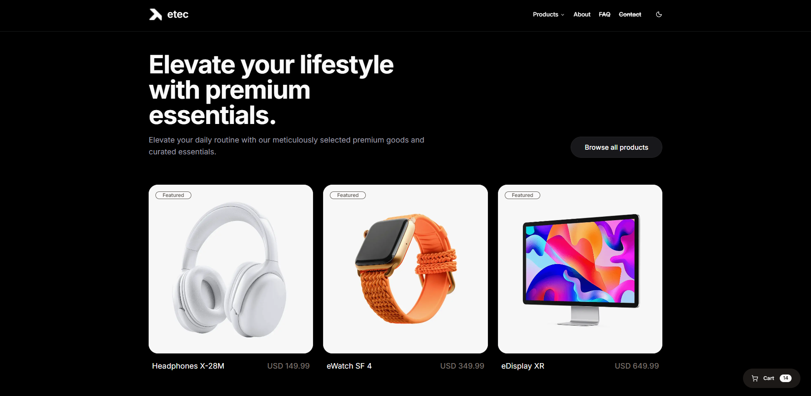

# ETEC Store



A modern e-commerce storefront built with Next.js, React, TypeScript, and Supabase.

## Overview

ETEC Store is a responsive e-commerce application focused on clean UI, performance, and maintainable architecture.

The project includes product browsing, product details pages, shopping cart functionality, authentication, checkout flow, and category filtering.

## Features

- Product catalog
- Product details page
- Category filtering
- Shopping cart
- Checkout page
- User authentication
- Password reset flow
- Dark / Light mode
- Responsive design
- Feature-based folder structure
- Server Components and Client Components

## Tech Stack

### Frontend

- Next.js 16
- React 19
- TypeScript
- Tailwind CSS v4
- Shadcn UI
- Radix UI

### Backend & Database

- Supabase
- Supabase Authentication

## Project Structure

```text
app/
components/
features/
lib/
public/
```

### Architecture

The application follows a Feature-Based Design approach.

```text
features/
├── auth/
├── cart/
├── checkout/
├── home/
├── products/
├── product-details/
└── about/
```

Each feature contains its own:

- Components
- Services
- Types
- Business logic

## Authentication Status

Authentication is implemented using Supabase Auth but is currently not enforced in the shopping flow.

Available flows:

- Login
- Registration
- Password Reset

## Cart System

The cart system allows users to:

- Add products
- Remove products
- Update quantities
- View order summary

## Getting Started

### Clone the repository

```bash
git clone https://github.com/imaginary-1374/Etec/tree/Etec-Next-Ts
```

### Install dependencies

```bash
npm install
```

### Create environment variables

Create a `.env.local` file:

```env
NEXT_PUBLIC_SUPABASE_URL=your_url
NEXT_PUBLIC_SUPABASE_ANON_KEY=your_key
```

### Run development server

```bash
npm run dev
```

Open:

```text
http://localhost:3000
```

## Future Improvements

- Require authentication before checkout
- Order history per user
- User profile management
- Product reviews live comment
- Admin dashboard
- Search functionality
- Wishlist
- Payment integration
- Role-based access control

## Learning Goals

This project was built to practice:

- Modern Next.js App Router
- React Server Components
- Authentication workflows
- Feature-based architecture
- State management patterns
- Supabase integration
- Scalable frontend structure

## Author

Abdelrhman Mohamed

Frontend Developer focused on React, Next.js, TypeScript, and Supabase.
